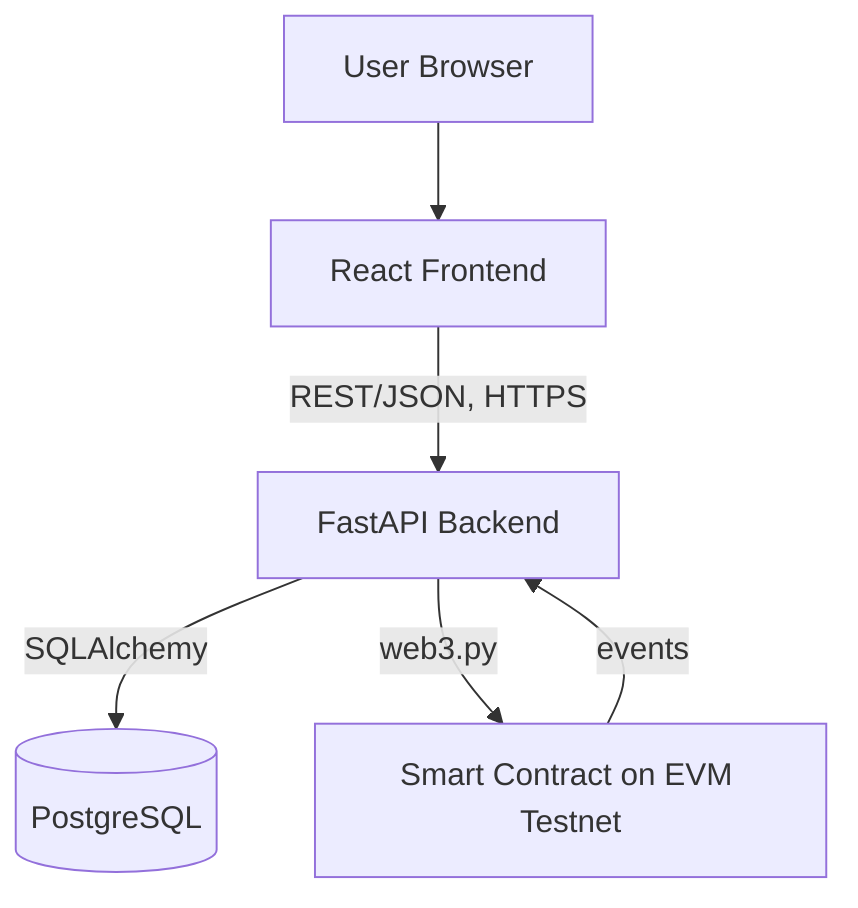

# ARCHITECTURE_AND_DEVELOPMENT_PLAN.md
## Blockchain-Based Transportation & Supply Chain Tracking System

**Status:** Single Source of Truth — all 3 developers follow this document. No architectural decisions are to be made independently. Any deviation must be proposed and documented here **before** implementation.

---

## 0. How To Use This Document

| Developer | Read in full | Primary sections |
|---|---|---|
| Frontend Developer | Yes | 1, 2, 3, 4, 7, 8, 10, 11, 12, 14, 16 |
| Backend Developer | Yes | 1–7, 9, 10, 11, 12, 14, 15, 16 |
| Blockchain Developer | Yes | 1–6, 9, 10, 11, 12, 14, 15, 16 |

If something you need isn't defined here, **stop and add it to this file** rather than inventing it locally.

---

## 1. Project Scope

### 1.1 What We ARE Building
A web prototype that tracks a single physical shipment through 5 custody stages (Manufacturer → Transporter → Warehouse → Distributor → Final Receiver), where key lifecycle events are written to an EVM smart contract for tamper-evident verification, while all queryable/bulk application data lives in PostgreSQL.

### 1.2 What We Are NOT Building
- A production logistics platform
- A general-purpose blockchain
- A multi-tenant SaaS product
- A real payments/token system
- A real IoT/GPS hardware integration (simulated only)
- A mobile app

### 1.3 Core Use Case
An admin/manufacturer creates a shipment. It is assigned to a transporter, physically moves through checkpoints and custody transfers, and is finally delivered. At any point, anyone with the shipment ID/QR can view a verifiable, tamper-evident history.

### 1.4 Target Users (roles)
- `admin` (manufacturer / shipment creator)
- `transporter`
- `warehouse_operator`
- `distributor`
- `receiver`
- `viewer` (read-only / public tracking page)

### 1.5 Main Demo Scenario
1. Admin creates a shipment → gets QR code.
2. Admin assigns a transporter.
3. Transporter records pickup (on-chain event).
4. Transporter/warehouse records a checkpoint.
5. Custody is transferred (transporter → warehouse → distributor).
6. Final receiver marks delivery.
7. Anyone scans the QR / opens the shipment page and sees the full, blockchain-verified history with tx hashes.

### 1.6 MVP Features
- Auth + roles
- Create shipment (DB + on-chain `createShipment`)
- Assign transporter
- Record pickup
- Record checkpoint (location/note)
- Transfer custody (with on-chain event)
- Mark delivered
- Shipment history view (merged DB + chain data)
- QR generation + QR scan lookup
- Tx hash + block explorer link display

### 1.7 Optional Features (post-MVP, only if time remains)
- Map view of checkpoints
- Email/notification on status change
- CSV export of shipment history
- Multi-shipment dashboard filters/search

### 1.8 Explicitly Out Of Scope
- Custom blockchain / consensus
- Token economy, payments, staking
- NFT marketplace
- Real hardware GPS/RFID integration
- AI features
- Offline-first / PWA support
- Multi-language i18n

---

## 2. System Architecture



**Frontend → Backend:** REST/JSON over HTTPS only. Frontend never talks to PostgreSQL or the blockchain directly.

**Backend → PostgreSQL:** All CRUD for application data (users, shipments metadata, vehicles, checkpoints, custody records) via SQLAlchemy.

**Backend → Blockchain:** All chain writes/reads go through `web3.py` in one integration module. Backend signs and sends transactions using a backend-controlled wallet (see §15), waits for confirmation, stores the resulting `transaction_hash` in PostgreSQL against the corresponding DB row.

**Golden rule:** The backend is the *only* component allowed to talk to the smart contract. Frontend never imports `web3.js`/`ethers.js` to write; it may optionally use a read-only viewer feature later, but this is not in MVP scope.

---

## 3. Responsibility Boundaries

### Frontend Developer
- **Builds:** All pages/components in §8, QR generation/scanning UI, forms, API calls via a single API client module.
- **Owns:** `/frontend` directory, UI state, client-side validation, routing.
- **Consumes:** REST API defined in §7 only.
- **Must NOT:** call the database directly, call the smart contract directly, invent new API endpoints/fields, implement blockchain business logic (e.g. deciding what counts as a valid custody transfer).

### Backend Developer
- **Builds:** FastAPI app, all REST endpoints, SQLAlchemy models/migrations, the `web3.py` integration module, auth/roles.
- **Owns:** `/backend` directory, the API contract, the database schema, transaction orchestration (DB write + chain write + confirmation).
- **Consumes:** Smart contract ABI/address published by the blockchain developer in `/blockchain/artifacts`.
- **Must NOT:** re-implement custody/state-transition rules that contradict the smart contract, let the frontend dictate schema, put bulk/query-heavy data on-chain.

### Blockchain Developer
- **Builds:** Solidity smart contract, deployment scripts, local/testnet deployment, ABI export.
- **Owns:** `/blockchain` directory, contract state machine, access control (roles/modifiers), events.
- **Exposes:** Compiled ABI + deployed contract address + a short function reference (mirrors §5) to the backend developer.
- **Must NOT:** build a second backend, a second database, or any API server. Must NOT store bulk data (names, addresses, free-text notes) on-chain.

---

## 4. Single Data Model — Canonical `Shipment`

This is the **only** Shipment shape anyone is allowed to use. Field names are final.

| Field | Type | Classification | Notes |
|---|---|---|---|
| `shipment_id` | UUID (string) | BOTH | Generated by backend, passed to contract as `bytes32` (hash of UUID) or uint256 counter — see §5 |
| `qr_code_value` | string | DATABASE ONLY | Encodes `shipment_id`, generated at creation |
| `manufacturer_id` | FK → users | DATABASE ONLY | |
| `origin` | string | DATABASE ONLY | Free text address |
| `destination` | string | DATABASE ONLY | Free text address |
| `cargo_description` | string | DATABASE ONLY | |
| `quantity` | integer | DATABASE ONLY | |
| `current_transporter_id` | FK → users | DATABASE ONLY | Mirrors on-chain `currentTransporter` |
| `current_custodian_id` | FK → users | DATABASE ONLY | Mirrors on-chain `currentCustodian` |
| `vehicle_id` | FK → vehicles | DATABASE ONLY | |
| `status` | enum | BOTH | Enum mirrored on-chain as `uint8`; see §5/§6 |
| `created_at` | timestamp | DATABASE ONLY | |
| `updated_at` | timestamp | DERIVED | Updated on every event write |
| `chain_shipment_ref` | uint256/bytes32 | BLOCKCHAIN | The identifier used inside the smart contract |
| `creation_tx_hash` | string | DATABASE ONLY | Stores proof of the on-chain creation event |
| `history` | list | DERIVED/COMPUTED | Built by backend by merging `checkpoints` + `custody_transfers` DB rows with on-chain event logs, ordered by timestamp |

**Rule:** `status` enum values (final, used identically in DB, contract, and frontend):
`CREATED → ASSIGNED → PICKED_UP → IN_TRANSIT → AT_WAREHOUSE → CUSTODY_TRANSFERRED → DELIVERED`

No developer may add, rename, or reorder these without updating this file first.

---

## 5. Blockchain Data Model

### 5.1 What Goes On-Chain (and only this)
- Shipment existence + identifier
- Status transitions (as enum/uint8)
- Current custodian address
- Event timestamps (via `block.timestamp`)
- Actor address performing each action

Free text (addresses, cargo descriptions, notes) **never** goes on-chain — only referenced by ID/hash if needed.

### 5.2 Roles (access control)
- `ADMIN_ROLE` — can create shipments, assign transporter
- `TRANSPORTER_ROLE` — can record pickup, checkpoint, transfer custody onward
- `WAREHOUSE_ROLE` / `DISTRIBUTOR_ROLE` — can accept custody, record checkpoint
- `RECEIVER_ROLE` — can mark delivered
Implemented via OpenZeppelin `AccessControl`. Role assignment is done by backend calling an admin-only `grantRole` at user-registration/onboarding time, mapping each backend user to a wallet address the backend controls (see §15 — custodial wallet model for MVP).

### 5.3 State Variable (per shipment)
```solidity
struct Shipment {
    uint256 id;
    address creator;
    address currentTransporter;
    address currentCustodian;
    Status status;
    uint256 createdAt;
}
enum Status { Created, Assigned, PickedUp, InTransit, AtWarehouse, CustodyTransferred, Delivered }
```

### 5.4 Functions

| Function | Caller Role | Purpose |
|---|---|---|
| `createShipment(uint256 shipmentId)` | ADMIN_ROLE | Registers shipment on-chain, status = Created, creator = msg.sender |
| `assignTransporter(uint256 shipmentId, address transporter)` | ADMIN_ROLE | Sets currentTransporter, status = Assigned |
| `recordPickup(uint256 shipmentId)` | TRANSPORTER_ROLE (must equal currentTransporter) | status = PickedUp, currentCustodian = msg.sender |
| `recordCheckpoint(uint256 shipmentId)` | current custodian only | Emits event only, no status change (status stays or moves to InTransit if currently PickedUp) |
| `transferCustody(uint256 shipmentId, address newCustodian)` | current custodian only | currentCustodian = newCustodian, status = CustodyTransferred |
| `markDelivered(uint256 shipmentId)` | RECEIVER_ROLE, must equal currentCustodian | status = Delivered |

Every function emits a matching event (`ShipmentCreated`, `TransporterAssigned`, `PickupRecorded`, `CheckpointRecorded`, `CustodyTransferred`, `ShipmentDelivered`) with `shipmentId`, relevant addresses, and `block.timestamp`. Events are the source the backend reads for the "blockchain history."

### 5.5 Transaction Flow
Backend → builds tx → signs with backend-held key for the acting role → sends → waits for receipt → stores `tx_hash` + `block_number` in the corresponding PostgreSQL row → returns response to frontend.

---

## 6. Database Schema (PostgreSQL)

```
users
  id UUID PK
  name TEXT
  email TEXT UNIQUE
  password_hash TEXT
  role TEXT  -- admin | transporter | warehouse_operator | distributor | receiver | viewer
  wallet_address TEXT  -- backend-managed address representing this user on-chain
  created_at TIMESTAMP

vehicles
  id UUID PK
  plate_number TEXT
  type TEXT
  transporter_id UUID FK -> users.id

shipments
  id UUID PK                          -- = shipment_id
  chain_shipment_ref BIGINT           -- numeric id used on-chain
  manufacturer_id UUID FK -> users.id
  origin TEXT
  destination TEXT
  cargo_description TEXT
  quantity INTEGER
  current_transporter_id UUID FK -> users.id NULL
  current_custodian_id UUID FK -> users.id NULL
  vehicle_id UUID FK -> vehicles.id NULL
  status TEXT
  qr_code_value TEXT
  creation_tx_hash TEXT
  created_at TIMESTAMP
  updated_at TIMESTAMP

checkpoints
  id UUID PK
  shipment_id UUID FK -> shipments.id
  recorded_by UUID FK -> users.id
  location TEXT
  note TEXT
  tx_hash TEXT
  created_at TIMESTAMP

custody_transfers
  id UUID PK
  shipment_id UUID FK -> shipments.id
  from_user_id UUID FK -> users.id
  to_user_id UUID FK -> users.id
  tx_hash TEXT
  created_at TIMESTAMP

shipment_events
  id UUID PK
  shipment_id UUID FK -> shipments.id
  event_type TEXT   -- CREATED | ASSIGNED | PICKED_UP | CHECKPOINT | CUSTODY_TRANSFER | DELIVERED
  actor_id UUID FK -> users.id
  tx_hash TEXT
  created_at TIMESTAMP
```

Indexes: `shipments.status`, `shipments.chain_shipment_ref`, `shipment_events.shipment_id`, `checkpoints.shipment_id`, `custody_transfers.shipment_id`.

`shipment_events` is the single append-only log the frontend's history view reads (populated on every state-changing action, alongside the more detailed `checkpoints`/`custody_transfers` rows). This prevents DB and chain history from drifting apart.

---

## 7. API Contract

Base path: `/api/v1`. Auth: JWT bearer token, role embedded in claims.

| Method | Path | Purpose | Auth | DB Effect | Blockchain Effect |
|---|---|---|---|---|---|
| POST | `/auth/login` | Login | none | read `users` | none |
| POST | `/shipments` | Create shipment | admin | insert `shipments`, `shipment_events` | `createShipment` |
| POST | `/shipments/{id}/assign` | Assign transporter | admin | update `shipments` | `assignTransporter` |
| POST | `/shipments/{id}/pickup` | Record pickup | transporter | update `shipments`, insert event | `recordPickup` |
| POST | `/shipments/{id}/checkpoint` | Record checkpoint | current custodian | insert `checkpoints`, event | `recordCheckpoint` |
| POST | `/shipments/{id}/handoff` | Transfer custody | current custodian | update `shipments`, insert `custody_transfers`, event | `transferCustody` |
| POST | `/shipments/{id}/deliver` | Mark delivered | receiver | update `shipments`, insert event | `markDelivered` |
| GET | `/shipments/{id}` | Get shipment detail | any authenticated | read `shipments` | none |
| GET | `/shipments/{id}/history` | Full merged history | any (public/viewer allowed) | read `shipment_events`, `checkpoints`, `custody_transfers` | read events via `web3.py` for verification |
| GET | `/shipments` | List/search shipments | authenticated | read `shipments` | none |
| GET | `/shipments/qr/{qr_value}` | Lookup by QR | none/public | read `shipments` | none |

Standard error shape: `{"error": {"code": "STRING_CODE", "message": "..."}}`. Common codes: `UNAUTHORIZED`, `FORBIDDEN_ROLE`, `INVALID_STATE_TRANSITION`, `NOT_FOUND`, `CHAIN_TX_FAILED`, `VALIDATION_ERROR`.

Every write endpoint response includes `{"shipment": {...}, "tx_hash": "0x...", "block_number": n}` once chain confirmation succeeds. If the chain call fails, the DB write is rolled back (see §9) and `CHAIN_TX_FAILED` is returned — no partial state.

---

## 8. Frontend Contract

| Page/Component | Data received from backend |
|---|---|
| Login | JWT + user role |
| Dashboard | `GET /shipments` list (id, status, origin, destination, updated_at) |
| Create Shipment (form) | posts to `POST /shipments`; receives created shipment + tx_hash |
| Shipment Details | `GET /shipments/{id}` |
| Tracking / QR Scan | `GET /shipments/qr/{qr_value}` → redirects to Shipment Details |
| History / Timeline | `GET /shipments/{id}/history` — renders ordered event list with tx hash + explorer link per event |
| Assign / Pickup / Checkpoint / Handoff / Deliver (action panels, shown per role + current status) | POST to respective endpoint; on success, refresh Shipment Details + History |

Frontend renders available actions purely by checking `shipment.status` + `user.role` against the state table in §5.4 — it must not encode its own business rules about what transition is legal; the backend/contract is authoritative and will reject illegal transitions (`INVALID_STATE_TRANSITION`).

---

## 9. Blockchain ↔ Backend Contract

```
Frontend → FastAPI endpoint → service layer → web3.py client → Smart Contract
                                     ↓
                               PostgreSQL (SQLAlchemy)
```

Pattern for every state-changing endpoint (applied identically in all of them):
1. Validate request + role + current DB status (must match allowed pre-state for the action).
2. Begin DB transaction; write the *pending* row changes.
3. Build and send the contract transaction via `web3.py` using the backend wallet mapped to the acting user.
4. Wait for receipt (`w3.eth.wait_for_transaction_receipt`), with a timeout (e.g. 30s) and retry-once policy.
5. On success: commit DB transaction, store `tx_hash`/`block_number`, insert `shipment_events` row, return response.
6. On failure (revert or timeout): roll back DB transaction, return `CHAIN_TX_FAILED` with the revert reason if available.

Backend reads on-chain events (for `/history`) via `w3.eth.get_logs` filtered by `shipmentId`, decoded with the ABI, and reconciled/merged with the DB `shipment_events` rows by `tx_hash` (DB row is the display layer; chain event is the verification layer — the UI shows both).

`web3.py` integration lives in one module: `/backend/app/blockchain/client.py`. No other backend module talks to `web3.py` directly.

---

## 10. Complete Request Flows

### A. Create Shipment
Frontend (form submit) → `POST /shipments` → backend validates admin role → insert `shipments` row (status=CREATED) → `web3.py` calls `createShipment` → wait for receipt → store `creation_tx_hash` → insert `shipment_events` (CREATED) → response with shipment + tx_hash → frontend shows QR + confirmation.

### B. Assign Transporter
Frontend → `POST /shipments/{id}/assign` (body: transporter_id) → backend checks status==CREATED → update `current_transporter_id` → contract `assignTransporter` → status=ASSIGNED → event logged → response → frontend updates status badge.

### C. Pickup
Frontend (transporter) → `POST /shipments/{id}/pickup` → backend checks caller==current_transporter, status==ASSIGNED → contract `recordPickup` → status=PICKED_UP, current_custodian=transporter → event logged → response.

### D. Checkpoint
Frontend (current custodian) → `POST /shipments/{id}/checkpoint` (location, note) → backend checks caller==current_custodian → insert `checkpoints` row → contract `recordCheckpoint` → event logged → response → frontend appends to timeline.

### E. Transfer Custody
Frontend (current custodian) → `POST /shipments/{id}/handoff` (to_user_id) → backend checks caller==current_custodian → insert `custody_transfers` row → contract `transferCustody` → current_custodian updated, status=CUSTODY_TRANSFERRED → event logged → response.

### F. Delivery
Frontend (receiver) → `POST /shipments/{id}/deliver` → backend checks caller==current_custodian AND role==receiver → contract `markDelivered` → status=DELIVERED → event logged → response → frontend shows "Delivered" + full verified timeline.

---

## 11. Project Folder Structure

```
/frontend
  /src
    /pages          (Login, Dashboard, CreateShipment, ShipmentDetails, Tracking, History)
    /components      (ActionPanel, Timeline, QRScanner, QRDisplay, StatusBadge)
    /api             (single api client module — apiClient.js)
    /hooks
    App.jsx

/backend
  /app
    /api             (route modules per resource: shipments.py, auth.py)
    /models          (SQLAlchemy models)
    /schemas         (Pydantic request/response schemas — mirrors §7 exactly)
    /services        (business logic, orchestrates DB + blockchain per §9)
    /blockchain
      client.py       (the ONLY web3.py integration point)
      abi.json        (copied from /blockchain/artifacts)
    /db
      migrations/
    main.py

/blockchain
  /contracts
    ShipmentTracking.sol
  /scripts           (deploy.js/py)
  /artifacts         (compiled ABI + deployed address — published for backend)
  /test

/docs
  ARCHITECTURE_AND_DEVELOPMENT_PLAN.md   (this file)
  api-contract.md (optional generated copy of §7)
```

---

## 12. Development Order

**Phase 1 — Contracts & Schemas (all 3, together, day 1):**
Finalize this document. No code before this phase is signed off by all three.

**Phase 2 — Blockchain (blockchain dev, days 2–3):**
Write + test `ShipmentTracking.sol` locally (Hardhat/Foundry), deploy to testnet, export ABI + address to `/blockchain/artifacts`.

**Phase 3 — Backend skeleton (backend dev, days 2–4, parallel to Phase 2):**
DB schema + migrations, models, auth, CRUD endpoints returning mock/DB-only data (blockchain calls stubbed).

**Phase 4 — Blockchain integration (backend dev, days 4–5):**
Once ABI/address exist, wire `client.py`, replace stubs with real chain calls per §9.

**Phase 5 — Frontend (frontend dev, days 2–5, parallel, against the API contract in §7 using a mock server or Postman collection until backend endpoints are live):**
Build all pages/components per §8.

**Phase 6 — Integration (all 3, days 6–7):**
Point frontend at real backend, backend at real deployed contract. Run full flows A–F end to end.

**Phase 7 — Testing & polish (all 3, day 7–8):**
Run test plan (§16), fix bugs, prepare demo (§20).

**Hard dependency:** Frontend cannot be wired to a live backend until Phase 3 endpoints exist (it can be built against mocks earlier). Backend blockchain integration (Phase 4) cannot start until the blockchain dev publishes ABI + address (end of Phase 2).

---

## 13. Git / Collaboration Rules

- **Branches:** `main` (protected, always demo-able) ← `dev` ← feature branches `feat/<area>-<short-desc>` (e.g. `feat/backend-handoff-endpoint`).
- **Commits:** Conventional commits: `feat:`, `fix:`, `docs:`, `chore:`, `refactor:`. Reference the section number of this doc when relevant, e.g. `feat(backend): implement §7 handoff endpoint`.
- **PRs:** Required to merge into `dev`. One reviewer (any other of the 3) approves. No direct pushes to `main`/`dev`.
- **Avoiding overwrites:** Each dev works only inside their top-level folder (`/frontend`, `/backend`, `/blockchain`). Shared files (this doc, `/docs`) are only edited via PR with a note in the PR description of what changed and why.
- **Contract/API changes:** Any change to §4 (data model), §5 (contract functions), §6 (schema), or §7 (API contract) must be proposed as a PR to this file first, tagged `docs:`, and acknowledged by the other two devs before implementation begins.
- **Shared docs location:** `/docs` in the repo. This file is the canonical version; do not fork copies.

---

## 14. Shared Constants / Naming

Use exactly these names everywhere (DB columns, API JSON fields, contract variables, frontend state):

`shipment_id`, `chain_shipment_ref`, `vehicle_id`, `transporter_id`, `custodian_id`, `manufacturer_id`, `receiver_id`, `status`, `tx_hash`, `block_number`, `checkpoint_id`, `event_type`.

Status enum string values (exact casing): `CREATED`, `ASSIGNED`, `PICKED_UP`, `IN_TRANSIT`, `AT_WAREHOUSE`, `CUSTODY_TRANSFERRED`, `DELIVERED`.

---

## 15. Security (MVP-level)

- **Authentication:** JWT, short expiry + refresh token, password hashing via bcrypt/argon2.
- **Authorization:** Role check middleware on every write endpoint, matched against §7 table.
- **Private key handling:** Backend uses a custodial wallet model for the prototype — one funded testnet wallet per role (or one wallet + role passed as a contract parameter, simpler for MVP). Keys are loaded from environment variables (`.env`, gitignored), never committed, never returned in any API response. Do NOT store private keys in GitHub, in the frontend, or in logs.
- **Environment variables:** `.env.example` committed with placeholder values; real `.env` gitignored in all three subfolders.
- **Input validation:** Pydantic schemas on every backend endpoint; contract-level `require()` checks as the final backstop.
- **API security:** Rate limiting on auth endpoints, CORS restricted to the frontend origin, HTTPS assumed in deployment.
- **Smart contract access control:** OpenZeppelin `AccessControl` roles as in §5.2; every state-changing function has a role/ownership modifier — no function is open to arbitrary callers.

---

## 16. Testing Plan

**Frontend:** page rendering, API error states (network failure, `FORBIDDEN_ROLE`, `INVALID_STATE_TRANSITION`), loading/disabled states during pending tx confirmation, invalid form input handling.

**Backend:** endpoint unit tests per route (happy path + each error code in §7), DB migration tests, auth/role middleware tests, `web3.py` integration tests against a local testnet (Hardhat node) mocking each contract function.

**Blockchain:** unit tests (Hardhat/Foundry) for every function in §5.4 — valid transitions, unauthorized-caller reverts, invalid-state-transition reverts, correct event emission with correct parameters.

**Integration (all 3, Phase 7):** run flows A–F end to end against the real deployed testnet contract; verify DB and chain stay consistent after each step; verify an unauthorized role attempting an action is rejected at both the API layer and the contract layer.

---

## 17. Definition of Done

- [ ] Shipment can be created with a unique ID
- [ ] QR code generated and scannable, resolves to the correct shipment
- [ ] Transporter can be assigned
- [ ] Pickup can be recorded
- [ ] Checkpoint can be recorded
- [ ] Custody can be transferred
- [ ] Delivery can be recorded
- [ ] A blockchain transaction exists for every required event (creation, assign, pickup, checkpoint, handoff, delivery)
- [ ] Backend can retrieve and decode blockchain event history
- [ ] Frontend displays the complete, merged DB+chain history with tx hashes
- [ ] PostgreSQL and blockchain state remain consistent after every action
- [ ] Unauthorized operations are rejected at both API and contract level
- [ ] The complete flow (A→F) works end to end from the UI against the deployed testnet contract

---

## 18. MVP vs Optional

**MUST HAVE:** auth+roles, create/assign/pickup/checkpoint/handoff/deliver, DB schema (§6), contract (§5), merged history view, QR generate+scan, tx hash display.

**SHOULD HAVE:** basic dashboard filtering by status, block-explorer links on tx hashes, loading/error states polish.

**NICE TO HAVE:** map view of checkpoints, CSV export, notifications.

---

## 19. "Do Not Build" Section

Do not spend time on:
- A custom blockchain or consensus mechanism
- A token/cryptocurrency economy
- An NFT marketplace
- Extra microservices beyond the single FastAPI backend
- AI/ML features of any kind
- Putting every database field on-chain
- Real GPS/IoT hardware integration
- A second backend or database built by the blockchain developer
- Direct frontend-to-contract or frontend-to-database calls
- Any feature not listed in §1.6/§1.7

---

## 20. Final Integration Checklist & Demo Sequence

**Pre-integration checklist (all 3 sign off):**
- [ ] Contract deployed to testnet, ABI/address published in `/blockchain/artifacts`
- [ ] Backend `.env` has correct contract address + RPC URL + wallet keys
- [ ] All §7 endpoints implemented and return the documented response shape
- [ ] Frontend points at the correct backend base URL
- [ ] All 6 flows (A–F) tested manually by at least one dev outside their own area

**Demo sequence for judges:**
1. Show the architecture diagram (§2) — 30 seconds of context.
2. Login as admin → create a shipment → show generated QR.
3. Assign a transporter → show status change + tx hash.
4. Switch role (transporter) → record pickup → show on-chain confirmation.
5. Record a checkpoint.
6. Transfer custody to warehouse/distributor.
7. Switch role (receiver) → mark delivered.
8. Open the History view → show full timeline with tx hashes → click through to a block explorer to prove immutability.
9. Attempt an unauthorized action (wrong role) → show it's rejected — demonstrates access control at both API and contract level.
