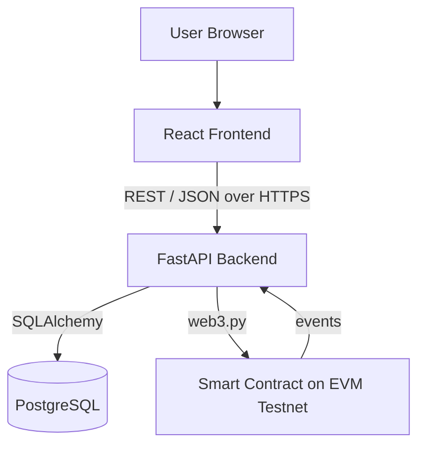

# ChainRoute

**Blockchain-verified chain-of-custody tracking for physical shipments.**

---

## Project Overview

ChainRoute is a web-based prototype for tracking a physical shipment as it moves through a transportation and supply-chain lifecycle — from manufacturer to final receiver. Each shipment is given a unique digital identity (with a QR code), and the key events in its journey (creation, assignment, pickup, checkpoints, custody transfers, delivery) are recorded through a smart contract, so the shipment's history can be independently verified and is resistant to tampering after the fact.

## Problem Statement

In multi-party transportation and supply chains, a shipment typically passes through several independent custodians — a manufacturer, one or more transporters, a warehouse, a distributor, and finally a receiver. Each handoff is usually recorded in a separate, siloed system (or on paper), which makes it hard to answer basic questions with confidence: Who had custody of this shipment, and when? Was a checkpoint or delivery record altered after the fact? Can two parties even agree on the sequence of events? ChainRoute addresses the specific problem of maintaining a single, verifiable, tamper-evident record of custody and status changes across all parties involved.

## Our Solution

ChainRoute combines a conventional web application with a smart contract to separate two different kinds of data:

- A **React web application** provides the interface for creating shipments, assigning transporters, and recording events.
- Each shipment gets a **unique digital identity**, represented as a **QR code**, so it can be looked up and tracked by anyone with access to it.
- A **FastAPI backend** is the single integration point between the frontend, the database, and the blockchain — it validates requests, enforces roles, and orchestrates writes to both.
- **PostgreSQL** stores the application's day-to-day data: shipment details, checkpoints, custody records, users, and vehicles.
- A **smart contract** on an EVM-compatible testnet records only the events that matter for verification — shipment creation, assignment, pickup, checkpoints, custody transfers, and delivery — so that this specific history cannot be silently altered later.

## How It Works

```
Manufacturer → Transporter → Warehouse → Distributor → Final Receiver
```

As a shipment moves through these stages, each significant event (creation, assignment, pickup, checkpoint, custody transfer, delivery) is written both to PostgreSQL (for fast querying and display) and to the smart contract (for verification). The backend later reconciles both records into a single timeline, so anyone viewing a shipment's history sees each event alongside the blockchain transaction hash that proves it occurred and wasn't altered afterward.

## Architecture



The frontend only ever talks to the backend over REST. The backend is the sole component that writes to PostgreSQL and the sole component that talks to the smart contract — no other layer accesses the database or the chain directly.

## Key Features

- Shipment creation with a unique digital identity and QR code
- Role-based actions: assign transporter, record pickup, record checkpoint, transfer custody, mark delivered
- Blockchain-recorded events for every major status change
- Merged shipment history view combining database records and on-chain transaction proofs
- QR-based shipment lookup

## Technology Stack

| Layer | Technology | Purpose |
|---|---|---|
| Frontend | React (JavaScript) | User interface, QR generation/scanning |
| Backend | Python, FastAPI | REST API, business logic, blockchain orchestration |
| Backend ORM | SQLAlchemy | Database access layer |
| Database | PostgreSQL | Application data (users, shipments, checkpoints, custody records) |
| Blockchain | EVM-compatible testnet, Solidity | Verifiable, tamper-evident event record |
| Blockchain integration | web3.py | Backend-to-smart-contract communication |

## Blockchain Usage

The smart contract stores only what genuinely benefits from immutability and independent verification: a shipment's identifier, its status transitions, the address of its current custodian, and a timestamped event for each major action (creation, assignment, pickup, checkpoint, custody transfer, delivery).

Everything else — names, addresses, cargo descriptions, quantities, vehicle details, and free-text notes — is stored in PostgreSQL. Putting this data on-chain would add cost and complexity without adding verification value, since it isn't the kind of data that benefits from tamper-evidence in the same way a custody record does.

Blockchain here provides tamper-evident event history, not full decentralization of the system: the backend remains a trusted component that submits transactions and serves the application, and the database remains the primary store for day-to-day application data.

## Shipment Lifecycle

```
Create → Assign → Pickup → Transit → Checkpoint → Handoff → Delivery → Verification
```

Each step updates the shipment's status in PostgreSQL and, for the events that matter for chain of custody, also triggers a corresponding smart contract transaction. "Verification" refers to viewing a shipment's history and confirming each recorded event against its on-chain transaction.

## Project Structure

```
/frontend
  /src
    /pages
    /components
    /api
    /hooks

/backend
  /app
    /api
    /models
    /schemas
    /services
    /blockchain
    /db
      migrations/

/blockchain
  /contracts
  /scripts
  /artifacts
  /test

/docs
  ARCHITECTURE_AND_DEVELOPMENT_PLAN.md
```

## Getting Started

### Prerequisites

- Node.js and npm (frontend)
- Python 3.x and pip (backend)
- PostgreSQL instance
- Access to an EVM-compatible testnet (e.g. via an RPC provider) and a funded testnet wallet

### Frontend Setup

```bash
cd frontend
npm install
npm start
```

### Backend Setup

```bash
cd backend
pip install -r requirements.txt
# configure environment variables (see below)
uvicorn app.main:app --reload
```

### PostgreSQL Setup

```bash
# create a database for the project
createdb chainroute

# run migrations
cd backend
alembic upgrade head
```

### Blockchain / Smart Contract Setup

```bash
cd blockchain
npm install
# compile and deploy to a testnet
npx hardhat compile
npx hardhat run scripts/deploy.js --network <testnet-name>
```

After deployment, copy the generated ABI and contract address into the backend's blockchain configuration (see `/backend/app/blockchain`).

## Environment Variables

Backend `.env`:

```
DATABASE_URL=
BLOCKCHAIN_RPC_URL=
PRIVATE_KEY=
CONTRACT_ADDRESS=
JWT_SECRET=
```

- `DATABASE_URL` — PostgreSQL connection string
- `BLOCKCHAIN_RPC_URL` — RPC endpoint for the target EVM testnet
- `PRIVATE_KEY` — backend wallet private key used to sign transactions (never commit real values)
- `CONTRACT_ADDRESS` — deployed smart contract address
- `JWT_SECRET` — secret used to sign authentication tokens

## Running the Project

1. Start PostgreSQL and ensure `DATABASE_URL` points to it.
2. Deploy (or confirm the deployment of) the smart contract and set `CONTRACT_ADDRESS` and `BLOCKCHAIN_RPC_URL` in the backend environment.
3. Start the backend (`uvicorn app.main:app --reload`) — it exposes the REST API and handles all database and blockchain communication.
4. Start the frontend (`npm start`) — it communicates with the backend exclusively over REST/JSON.

## Example Workflow

1. Create a shipment
2. Generate the shipment's unique ID and QR code
3. Assign a transporter
4. Record pickup
5. Record a checkpoint
6. Transfer custody
7. Mark the shipment delivered
8. Verify the shipment's history against its recorded blockchain transactions

## Security

- **Authentication:** JWT-based, issued on login.
- **Authorization:** Role-based access control enforced on every state-changing API endpoint.
- **Private key handling:** Backend wallet keys are loaded from environment variables and are never committed to source control or exposed via the API.
- **Environment variables:** Sensitive configuration is kept out of the repository via `.env` files (gitignored), with `.env.example` provided as a template.
- **Smart contract access control:** Role-restricted functions ensure only authorized addresses can perform actions like assigning a transporter, recording custody transfers, or marking a shipment delivered.

## Team Structure

1. PPT / Research — Blockchain + Problem
2. PPT / Research — Transportation + Supply Chain
3. PPT / Research — Business + Innovation
4. Frontend — React
5. Backend — FastAPI + PostgreSQL
6. Blockchain — Solidity + web3.py

## Roadmap

- **Phase 1 — Architecture:** Finalize data model, API contract, and smart contract design.
- **Phase 2 — Smart Contract:** Implement, test, and deploy the contract to a testnet.
- **Phase 3 — Backend:** Build the database schema and REST API.
- **Phase 4 — Frontend:** Build the React application against the defined API contract.
- **Phase 5 — Integration:** Connect frontend, backend, database, and deployed contract.
- **Phase 6 — Testing:** Validate the full shipment lifecycle end to end.
- **Phase 7 — Demo:** Present the working prototype.

## Future Scope

The following are potential extensions and are **not** part of the current prototype:

- IoT/GPS integration for automated location tracking
- Automated alerts and notifications on status changes
- Support for additional supply-chain participant types
- Advanced analytics and reporting
- Additional verification mechanisms beyond the current event log

## Limitations

- This is a prototype built and tested on a blockchain testnet, not a production deployment.
- Blockchain transactions introduce latency and, on a mainnet deployment, would incur gas costs; this is not addressed by the current design.
- Data such as cargo descriptions, addresses, and user details lives off-chain in PostgreSQL and is not independently verifiable the way on-chain events are.
- The system verifies that recorded events occurred and weren't altered after the fact — it does not verify physical-world conditions (e.g. that a shipment's actual contents match its description).

## License

No license has been selected for this project yet. A license will be added prior to any public or production use.

---

Built with the goal of making transportation records more transparent, verifiable and tamper-evident.
