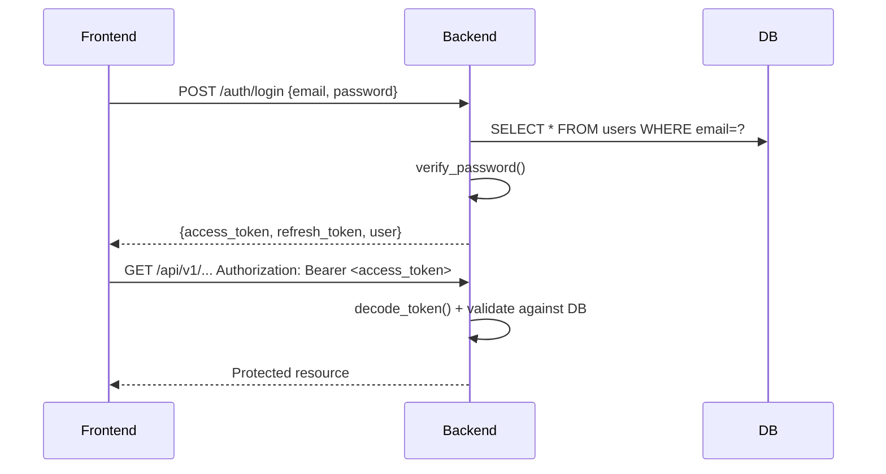

# Authentication & Authorization

## Overview
JWT-based authentication with role-based access control (RBAC) and identity-based checks for custodial actions.

## JWT Tokens

### Access Token
- **Algorithm:** HS256
- **Expiry:** 30 minutes (configurable via `JWT_EXPIRY_MINUTES`)
- **Payload:**
  ```json
  {
    "sub": "user_uuid",
    "email": "user@example.com",
    "role": "admin",
    "exp": 1234567890
  }
  ```

### Refresh Token
- **Algorithm:** HS256
- **Expiry:** 7 days (configurable via `JWT_REFRESH_EXPIRY_DAYS`)
- **Payload:**
  ```json
  {
    "sub": "user_uuid",
    "email": "user@example.com",
    "role": "admin",
    "type": "refresh",
    "exp": 1234567890
  }
  ```

### Token Usage
Include in Authorization header:
```
Authorization: Bearer <access_token>
```

## Password Hashing
- **Algorithm:** bcrypt (via Passlib)
- **Cost Factor:** Default (12 rounds)
- Never store plaintext passwords

## Roles

| Role | Description |
|------|-------------|
| `admin` | Manufacturer/shipment creator; can create shipments, assign transporters |
| `transporter` | Can record pickup, checkpoints, transfer custody |
| `warehouse_operator` | Can accept custody, record checkpoints |
| `distributor` | Can accept custody, record checkpoints |
| `receiver` | Can mark delivery (must be current custodian) |
| `viewer` | Read-only access to shipments and history |

## Authorization Rules

### Role Checks (Middleware)
Enforced on every write endpoint per §7:

| Endpoint | Required Role |
|----------|---------------|
| `POST /shipments` | `admin` |
| `POST /shipments/{id}/assign` | `admin` |
| `POST /shipments/{id}/pickup` | `transporter` |
| `POST /shipments/{id}/checkpoint` | Any (identity check below) |
| `POST /shipments/{id}/handoff` | Any (identity check below) |
| `POST /shipments/{id}/deliver` | `receiver` |

### Identity Checks (Business Logic)
Additional checks in service layer:

| Action | Required Identity |
|--------|-------------------|
| Pickup | Caller == `current_transporter_id` |
| Checkpoint | Caller == `current_custodian_id` |
| Handoff | Caller == `current_custodian_id` |
| Deliver | Caller == `current_custodian_id` AND role == `receiver` |

**Important:** Role is embedded in JWT but **re-validated against the `users` table on every protected request**. Never trust the JWT role claim alone.

## Custodial Wallet Model

### Architecture
For MVP, the backend uses a **custodial wallet model**:
- One funded testnet wallet per role (or single wallet with role passed as contract parameter)
- Private keys loaded from environment variables (`.env`, gitignored)
- Backend signs all transactions on behalf of users
- Users never handle private keys

### Wallet Address Mapping
Each user has a `wallet_address` field in the database:
- Populated at user registration/onboarding by admin
- Used by backend to identify the on-chain actor for contract calls
- Contract uses OpenZeppelin AccessControl with roles granted to these addresses

### Private Key Security
- Stored in `BACKEND_WALLET_PRIVATE_KEY` environment variable
- **Never** committed to git
- **Never** returned in API responses
- **Never** logged
- Only used server-side in `app/blockchain/client.py`

## Login Flow



## Rate Limiting
- `/auth/login` endpoint: Rate limited (implementation via middleware recommended)
- Prevents brute-force attacks

## CORS
- Restricted to `CORS_ALLOWED_ORIGIN` (default: `http://localhost:3000`)
- Configured in FastAPI middleware

## Security Checklist
- [ ] JWT_SECRET is strong and rotated in production
- [ ] Tokens use short expiry + refresh token rotation
- [ ] Passwords hashed with bcrypt
- [ ] Private keys only in environment variables
- [ ] CORS restricted to frontend origin
- [ ] Role re-validated against DB on every request
- [ ] Identity checks for custodial actions
- [ ] No private keys in logs/responses
- [ ] SQL injection prevented via SQLAlchemy parameterization